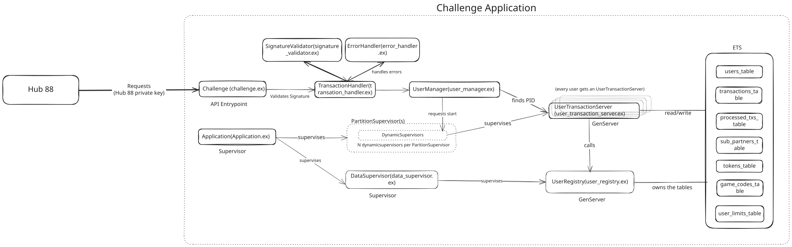

# Elixir Developer Challenge

As a Hub88 developer, you will be interacting directly with the Hub88 APIs, the "Game Providers APIs" and the "Operators APIs".

An "Operator" needs to implement the API defined by the [Operator Documentation](https://hub88.io/docs/operator) to handle received requests from Game providers via Hub88.

**To test your skills, you need to develop your own Operator's "Wallet API" as an Elixir application and discuss the solution in a technical meeting.**

**Note**: There are no explicit deadlines. However, do note that proceeding with your challenge is subject to the availability of the position. Keep in touch with the recruitment contact to plan your delivery.

Please be strict with the following guidelines:

- Your code must be well-written: Good formatting, readable, maintainable
- Your code must be on GitHub as a private repository. Send an invite to [@bit4bit, @shegx01, @gokul-poongodi, @lenileiro, @masudme09, @VigneshwaranSenthilvel]
- Your project must be a `mix` project
- Your application name must be `:challenge`
- Your project must only use Elixir core modules, no extra dependencies
- Your project must only use Elixir OTP to manage data in application memory. Do NOT use databases (ex: PostgreSQL)
- Your project must implement the `Challenge` module with the following public functions:

  ```elixir
  @doc """
  Start a linked and isolated supervision tree and return the root server that
  will handle the requests.
  """
  @spec start :: GenServer.server()

  @doc """
  Create non-existing users with currency as "USD" and amount as 100_000.

  It must ignore empty binary `""` or if the user already exists.
  """
  @spec create_users(server :: GenServer.server(), users :: [String.t()]) :: :ok

  @doc """
  The same behavior is from `POST /transaction/bet` docs.

  The `body` parameter is the "body" from the docs as a map with keys as atoms.
  The result is the "response" from the docs as a map with keys as atoms.
  """
  @spec bet(server :: GenServer.server(), body :: map) :: map

  @doc """
  The same behavior is from `POST /transaction/win` docs.

  The `body` parameter is the "body" from the docs as a map with keys as atoms.
  The result is the "response" from the docs as a map with keys as atoms.
  """
  @spec win(server :: GenServer.server(), body :: map) :: map
  ```
- Your application must address corner-case scenarios, delivering the expected response status
- Your application must work properly under high throughput with high availability
- Your application must prioritize handling requests to many users as possible

Your project can have any structure with any additional modules, but only the `Challenge` module will be tested by an `ExUnit` script generated by Hub88 with hundreds of test cases.

Your project must successfully:

- Run the test script
- Pass on all test cases directly related to the Operator API documentation
- Pass on the majority (> 80%) of the test cases related to performance and integrity

If the points above are satisfied, a technical interview will be scheduled to discuss the results and the development process of the challenge.

For further clarifications, be in touch with the recruitment contact.

------

# Elixir Developer Solution
Here is the architecture diagram `architecture.excalidraw.svg`


Note: Tests could run slightly (7-8 seconds on my machine)slow, as some of the performance tests in `test/integration/fault_tolerance_test.exs` test for high loads, e.g. 5000 users. simultaneusly seeing crashes etc. Redudcing that number will speed up tests.

## API Contract Compliance

- **Strict Adherence to Hub88 API Spec:**
  All endpoints are implemented to match the [Hub88 Operator API Reference](https://docs.hub88.io/developer-docs/operator-api-reference/wallet-api) exactly, including required fields, error codes, and response formats.

- **Idempotency & Retry Safety:**
  Each `transaction_uuid` is processed at most once, ensuring safe handling of retries and duplicate requests as per Hub88's requirements.

### Error Handling & Response Codes

- **Comprehensive Error Handling:**
  All documented error codes and statuses are returned as specified, covering invalid tokens, insufficient funds, duplicate transactions, and more.

### Security & Signature Verification

- **Signature Verification:**
  Every request is validated using RSA-SHA256 signatures, ensuring authenticity and integrity.

## Performance & Scalability

- **High Throughput by Design:**
  The solution leverages Elixir/OTP primitives like PartitionSupervisor and DynamicSupervisors to handle thousands of concurrent users and requests efficiently.

- **Supervisor Tuning for Real-World Load:**
  The supervision tree is explicitly configured (`max_restarts: 50_000`, `max_seconds: 60`, one partition per CPU core) to tolerate mass process churn and rapid restarts.

- **No Data Loss on Crashes:**
  All critical data (user balances, transaction history, idempotency keys) is stored in ETS tables managed by supervised GenServers, ensuring persistence and consistency even if user processes or supervisors crash and restart.

- **Tested for Scalability:**
  The test suite includes scenarios with 5,000+ users and thousands of concurrent requests, demonstrating the system's ability to scale and recover in a production-like environment.


## Performance and concurrency Concerns

- **Per-user GenServer:**
  Each user has a dedicated `UserTransactionServer` GenServer, serializing all their transactions. This prevents race conditions for a single user's balance.

- **Atomic Transaction Idempotency:**
  Transaction UUIDs are stored in an ETS table using `:ets.insert_new`, ensuring only one process can process a given transaction, even under concurrent requests.

- **Atomic Balance Updates:**
  All balance changes are performed via a GenServer call to `UserRegistry`, which atomically checks and updates the balance, preventing double-spending.

- **Race Condition Safety:**
  If two requests for the same transaction arrive at the same time, only one will be processed as new; the other will be recognized as a duplicate and handled accordingly.


## Signature Verification

All API requests (e.g., `/transaction/bet`, `/transaction/win`) must include a cryptographic signature in the `X-Hub88-Signature` header, as required by the [Hub88 Wallet API spec](https://docs.hub88.io/developer-docs/operator-api-reference/wallet-api).

This wasnt required, but as I wasnt sure and the recruiter took time to get back to me I went ahead and implemented basic signature verification.

**How it works:**
- The client signs the JSON-encoded request body using **RSA-SHA256** with the private key.
- The signature is base64-encoded and sent in the `X-Hub88-Signature` header.
- The server (this app) base64-decodes the signature and verifies it using the public key and the same JSON encoding.
- Only requests with valid signatures are processed; invalid signatures are rejected with the correct error code.

**Test keys** (`priv/demo_priv.pem`, `priv/demo_pub.pem`) are used for local development and can be regenerated with:
```sh
openssl genpkey -algorithm RSA -out priv/demo_priv.pem -pkeyopt rsa_keygen_bits:2048
openssl rsa -pubout -in priv/demo_priv.pem -out priv/demo_pub.pem
```

This implementation is fully compliant with the assignment and Hub88 requirements, using only Elixir/Erlang standard libraries.

**Note:** These keys are for testing only and are safe to commit to the repository.
